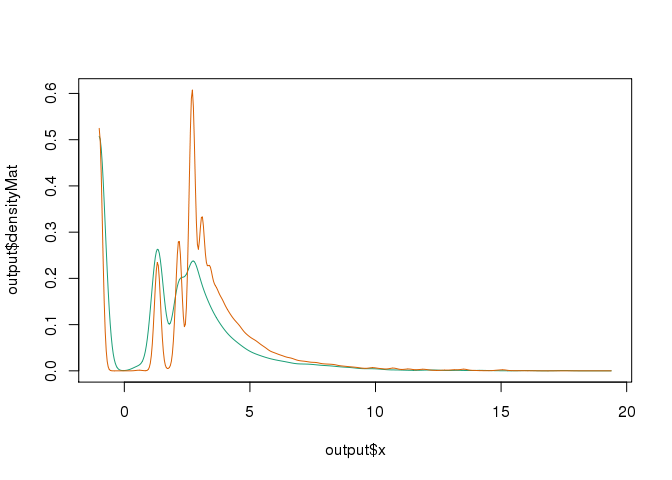

Process raw data at the University of Minnesota Supercomputer Institute
=======================================================================

``` r
#!/bin/bash
#PBS -l mem=956gb,nodes=1:ppn=32,walltime=2:00:00 
#PBS -m a
#PBS -M gearh006@umn.edu 
#PBS -q ram1t 

wd=/home/bardwell/gearhart/axo/axo4
dd=/home/echeverr/gearhart/axo
cd $wd


cat << EOF > solexa.r
library("ShortRead")

#Illumina small RNA-Seq 3' adapter:  TCGTATGCCGTCTTCTGCTTGT
adapter <- DNAString("TCGTATGCCGTCTTCTGCTTGT")

am1<-readBaseQuality("/home/echeverr/gearhart/miRNA-Solexa/AM0001", seqPattern="*_1.seq.txt", prbPattern="*_1.prb.txt",type="Solexa")
am1<-am1[alphabetScore(am1) > 800]
am1<-am1[vcountPattern("-",sread(am1))==0]
am1trimmed<-trimLRPatterns(Rpattern=adapter,Lpattern=adapter,subject=am1,max.Rmismatch=0.1)
writeFastq(am1trimmed,file="/home/bardwell/gearhart/am1_qf_trim.fastq.gz",full=TRUE)

am2<-readBaseQuality("/home/echeverr/gearhart/miRNA-Solexa/AM0002", seqPattern="*_1.seq.txt", prbPattern="*_1.prb.txt",type="Solexa")
am2<-am2[alphabetScore(am2) > 800]
am2<-am2[vcountPattern("-",sread(am2)) == 0]
am2trimmed<-trimLRPatterns(Rpattern=adapter, Lpattern=adapter, subject=am2,max.Rmismatch=0.1)
writeFastq(am2trimmed,file="/home/bardwell/gearhart/am2_qf_trim.fastq.gz",full=TRUE)


#download("ftp://mirbase.org/pub/mirbase/21/mature.fa.gz",dest="mature.fa.gz")
#gunzip("mature.fa.gz")
mature<-readRNAStringSet("mature.fa")
matureDNA<-DNAStringSet(mature)
writeXStringSet(matureDNA,"matureDNA.fa")

EOF

module load R/3.2.0_intel_mkl 
export R_LIBS_USER="/panfs/roc/groups/10/bardwell/shared/R"
#R --no-save < solexa.r


#build indices
#cd $wd/index
#bowtie-build -f miRvertebrata_8.2.fasta miRvertebrata
#bowtie-build -f hairpinDNA.fa hairpin
#bowtie-build -f matureDNA.fa mature

export BOWTIE_INDEXES=$wd/index/
module load bowtie/1.0.0
module load samtools/0.1.18

for i in am1_qf_trim am2_qf_trim
do
 gunzip -c $i.fastq.gz > $i.fastq


 #align to mirvertebrata 8.2 database 
 bowtie -t -v 2 -p 32 -e 99999 --norc miRvertebrata --solexa-quals $i.fastq -S $i.mirvertebrata.sam
 samtools view -bS -F 0x4 $i.mirvertebrata.sam > $i.mirvertebrata.unsorted.bam
 samtools sort $i.mirvertebrata.unsorted.bam $i.mirvertebrata
 samtools index $i.mirvertebrata.bam 

 #align to mature miRNA database
 bowtie -t -p 32 -e 99999 --norc mature --solexa-quals $i.fastq  --un $i.unmapped2mature.fastq -S $i.mature.sam
 samtools view -bS -F 0x4 $i.mature.sam > $i.mature.unsorted.bam
 samtools sort $i.mature.unsorted.bam $i.mature
 samtools index $i.mature.bam

 #cleanup
 #rm $i.*.sam
 rm $i.*.unsorted.bam

done


cat << EOF > stringdist.r 

library("ShortRead")
library("BiocParallel")
library("dplyr")
library("magrittr")
library("tidyr")
library("stringdist")
library("pryr")
library("flashClust")


(fls<-list.files(".",pattern=glob2rx("am?_qf_trim.unmapped2mature.fastq"),full.names=F))
temp<-do.call(cbind,lapply(fls,readFastq))
table(width(sread(temp[[1]])))

fullSeqHash <- function (x) {
  x<-x[width(x)>=20 & width(x)<=24] #based on table above
  seed<-as.data.frame(table(as.factor(as.character(sread(x)))))
  seed<-seed[with(seed,order(-Freq)),]
  return(seed)
}

amFSH<-lapply(temp,fullSeqHash)
names(amFSH)<-c("am1","am2")
for (i in names(amFSH)) {amFSH[[i]]$sample <- i}
amFSH<-do.call(rbind,amFSH) %>% spread(sample,Freq,fill=0)
dim(amFSH)
save(amFSH,file="amFSH.rdata")

(nt<-detectCores())
register(MulticoreParam(workers=nt))
#load("amFSH.rdata")
amFSHs<-amFSH %>% filter((am1+am2)>7)
dim(amFSHs)
system.time(d<-as.dist(stringdistmatrix(amFSHs$Var1,amFSHs$Var1,method="lv",nthread=nt)))
object_size(d)
system.time(h<-hclust(d))
object_size(h)
amFSHs$clust2<-cutree(h,h=2)
amFSHs$clust3<-cutree(h,h=3)
amFSHs$clust4<-cutree(h,h=4)
amFSHs$clust5<-cutree(h,h=5)
amFSHs$clust6<-cutree(h,h=6)
amFSHs$clust7<-cutree(h,h=7)
amFSHs$clust8<-cutree(h,h=8)
save(amFSHs,file="amFSHs.rdata")

quit(save="no")

EOF

R --no-save < stringdist.r
```

Libraries
=========

``` r
#library("downloader")
library("Biostrings")
```

    ## Loading required package: BiocGenerics
    ## Loading required package: parallel
    ## 
    ## Attaching package: 'BiocGenerics'
    ## 
    ## The following objects are masked from 'package:parallel':
    ## 
    ##     clusterApply, clusterApplyLB, clusterCall, clusterEvalQ,
    ##     clusterExport, clusterMap, parApply, parCapply, parLapply,
    ##     parLapplyLB, parRapply, parSapply, parSapplyLB
    ## 
    ## The following object is masked from 'package:stats':
    ## 
    ##     xtabs
    ## 
    ## The following objects are masked from 'package:base':
    ## 
    ##     anyDuplicated, append, as.data.frame, as.vector, cbind,
    ##     colnames, do.call, duplicated, eval, evalq, Filter, Find, get,
    ##     intersect, is.unsorted, lapply, Map, mapply, match, mget,
    ##     order, paste, pmax, pmax.int, pmin, pmin.int, Position, rank,
    ##     rbind, Reduce, rep.int, rownames, sapply, setdiff, sort,
    ##     table, tapply, union, unique, unlist, unsplit
    ## 
    ## Loading required package: S4Vectors
    ## Loading required package: stats4
    ## Loading required package: IRanges

    ## Warning: multiple methods tables found for 'score'

    ## Warning: multiple methods tables found for 'score<-'

    ## 
    ## Attaching package: 'IRanges'
    ## 
    ## The following objects are masked from 'package:BiocGenerics':
    ## 
    ##     score, score<-
    ## 
    ## Loading required package: XVector

    ## Warning: replacing previous import by 'IRanges::score' when loading
    ## 'XVector'

    ## Warning: replacing previous import by 'IRanges::score<-' when loading
    ## 'XVector'

    ## Warning: replacing previous import by 'IRanges::score' when loading
    ## 'Biostrings'

    ## Warning: replacing previous import by 'IRanges::score<-' when loading
    ## 'Biostrings'

    ## Warning: multiple methods tables found for 'score'

``` r
library("ShortRead")
```

    ## Loading required package: BiocParallel
    ## Loading required package: Rsamtools
    ## Loading required package: GenomeInfoDb

    ## Warning: replacing previous import by 'IRanges::score' when loading
    ## 'GenomeInfoDb'

    ## Warning: replacing previous import by 'IRanges::score<-' when loading
    ## 'GenomeInfoDb'

    ## Warning: multiple methods tables found for 'organism'

    ## Warning: multiple methods tables found for 'species'

    ## 
    ## Attaching package: 'GenomeInfoDb'
    ## 
    ## The following objects are masked from 'package:BiocGenerics':
    ## 
    ##     organism, species
    ## 
    ## Loading required package: GenomicRanges

    ## Warning: replacing previous import by 'IRanges::score' when loading
    ## 'GenomicRanges'

    ## Warning: replacing previous import by 'IRanges::score<-' when loading
    ## 'GenomicRanges'

    ## Warning: replacing previous import by 'GenomeInfoDb::species' when loading
    ## 'GenomicRanges'

    ## Warning: replacing previous import by 'GenomeInfoDb::organism' when
    ## loading 'GenomicRanges'

    ## Warning: multiple methods tables found for 'score'

    ## Warning: multiple methods tables found for 'score<-'

    ## Loading required package: GenomicAlignments

    ## Warning: replacing previous import by 'IRanges::score' when loading
    ## 'GenomicAlignments'

    ## Warning: replacing previous import by 'IRanges::score<-' when loading
    ## 'GenomicAlignments'

    ## Warning: replacing previous import by 'GenomeInfoDb::species' when loading
    ## 'GenomicAlignments'

    ## Warning: replacing previous import by 'GenomeInfoDb::organism' when
    ## loading 'GenomicAlignments'

    ## Warning: replacing previous import by 'IRanges::score' when loading
    ## 'ShortRead'

    ## Warning: replacing previous import by 'IRanges::score<-' when loading
    ## 'ShortRead'

    ## Warning: replacing previous import by 'GenomeInfoDb::species' when loading
    ## 'ShortRead'

    ## Warning: replacing previous import by 'GenomeInfoDb::organism' when
    ## loading 'ShortRead'

``` r
library("BiocParallel")
library("preprocessCore")
library("GenomicAlignments")
library("readxl")
library("dplyr")
```

    ## 
    ## Attaching package: 'dplyr'
    ## 
    ## The following object is masked from 'package:ShortRead':
    ## 
    ##     id
    ## 
    ## The following objects are masked from 'package:GenomicAlignments':
    ## 
    ##     first, last
    ## 
    ## The following objects are masked from 'package:GenomicRanges':
    ## 
    ##     intersect, setdiff, union
    ## 
    ## The following object is masked from 'package:GenomeInfoDb':
    ## 
    ##     intersect
    ## 
    ## The following objects are masked from 'package:Biostrings':
    ## 
    ##     collapse, intersect, setdiff, setequal, union
    ## 
    ## The following object is masked from 'package:XVector':
    ## 
    ##     slice
    ## 
    ## The following objects are masked from 'package:IRanges':
    ## 
    ##     collapse, desc, intersect, setdiff, slice, union
    ## 
    ## The following object is masked from 'package:S4Vectors':
    ## 
    ##     rename
    ## 
    ## The following objects are masked from 'package:BiocGenerics':
    ## 
    ##     combine, intersect, setdiff, union
    ## 
    ## The following object is masked from 'package:stats':
    ## 
    ##     filter
    ## 
    ## The following objects are masked from 'package:base':
    ## 
    ##     intersect, setdiff, setequal, union

``` r
library("ggplot2")
library("magrittr")
```

    ## 
    ## Attaching package: 'magrittr'
    ## 
    ## The following object is masked from 'package:ShortRead':
    ## 
    ##     functions

``` r
library("tidyr")
```

    ## 
    ## Attaching package: 'tidyr'
    ## 
    ## The following object is masked from 'package:magrittr':
    ## 
    ##     extract
    ## 
    ## The following object is masked from 'package:IRanges':
    ## 
    ##     expand

``` r
library("pryr")
```

    ## 
    ## Attaching package: 'pryr'
    ## 
    ## The following object is masked from 'package:dplyr':
    ## 
    ##     %.%
    ## 
    ## The following object is masked from 'package:ShortRead':
    ## 
    ##     compose

``` r
library("readxl")
library("flashClust")
```

    ## 
    ## Attaching package: 'flashClust'
    ## 
    ## The following object is masked from 'package:stats':
    ## 
    ##     hclust

``` r
library("quantro")
```

    ## Warning: replacing previous import by 'Biostrings::score' when loading
    ## 'minfi'

    ## Warning: replacing previous import by 'GenomicRanges::score<-' when
    ## loading 'minfi'

    ## Warning: multiple methods tables found for 'species'

    ## Warning: replacing previous import by 'IRanges::score' when loading
    ## 'GenomicFeatures'

    ## Warning: replacing previous import by 'IRanges::score<-' when loading
    ## 'GenomicFeatures'

    ## Warning: replacing previous import by 'GenomeInfoDb::species' when loading
    ## 'GenomicFeatures'

    ## Warning: replacing previous import by 'GenomeInfoDb::organism' when
    ## loading 'GenomicFeatures'

    ## Warning: replacing previous import by 'GenomeInfoDb::organism' when
    ## loading 'rtracklayer'

    ## Warning: replacing previous import by 'IRanges::score<-' when loading
    ## 'rtracklayer'

    ## Warning: replacing previous import by 'IRanges::score' when loading
    ## 'rtracklayer'

    ## Warning: multiple methods tables found for 'score'

    ## Warning: multiple methods tables found for 'score<-'

    ## Warning: multiple methods tables found for 'organism'

    ## Setting options('download.file.method.GEOquery'='curl')

``` r
#setwd("/mnt/afp/micah/R/umn-gcd-bioinformatics-axolotl/axo4")
setwd("/home/bardwell/gearhart/amex-miR/")
```

Read in sequences unmapped to MirBase 21
========================================

This section reads in the fastq sequences that did not have any matches to mirBase 21. The fullSeqHash function builds a hash table and enumerates the number of times each sequence occured in each sample.

``` r
fls<-list.files(".",pattern=glob2rx("am?_qf_trim.unmapped2mature.fastq"),full.names=F)
fls
temp<-do.call(cbind,lapply(fls,readFastq))
table(width(sread(temp[[1]])))

fullSeqHash <- function (x) {
  x<-x[width(x)>19 & width(x)<24] #based on table above
  seed<-as.data.frame(table(as.factor(as.character(sread(x)))))
  seed<-seed[with(seed,order(-Freq)),]
  return(seed)
}

amFSH<-lapply(temp,fullSeqHash)
names(amFSH)<-c("am1","am2")
for (i in names(amFSH)) {amFSH[[i]]$sample <- i}
amFSH<-do.call(rbind,amFSH) %>% spread(sample,Freq,fill=0)
dim(amFSH)
amFSH[grep("GGCTTCAAGGATCGCTCGGG",amFSH$Var1),]
save(amFSH,file="amFSH.rdata")
```

Analysis of miRbase 21 Mapping Results
======================================

This section counts the number of reads in the bam files that are mapped to each miR. A summary of the known changes or changes that make up more than 5% of the total are tabulated.

``` r
(fls <- list.files(".", pattern=glob2rx("am*qf_trim.mature.bam"),full=TRUE))
```

    ## [1] "./am1_qf_trim.mature.bam" "./am2_qf_trim.mature.bam"

``` r
bamlst <- BamFileList(fls,yieldSize=1000000)
(gr <- GRanges(seqnames(seqinfo(bamlst[[1]])),IRanges(1, seqlengths(bamlst[[1]]))))
```

    ## GRanges object with 35828 ranges and 0 metadata columns:
    ##                 seqnames    ranges strand
    ##                    <Rle> <IRanges>  <Rle>
    ##       [1]   cel-let-7-5p   [1, 22]      *
    ##       [2]   cel-let-7-3p   [1, 22]      *
    ##       [3]   cel-lin-4-5p   [1, 21]      *
    ##       [4]   cel-lin-4-3p   [1, 22]      *
    ##       [5]   cel-miR-1-5p   [1, 22]      *
    ##       ...            ...       ...    ...
    ##   [35824]   ame-miR-9895   [1, 22]      *
    ##   [35825]   ame-miR-9896   [1, 22]      *
    ##   [35826]   ame-miR-3478   [1, 20]      *
    ##   [35827] cre-miR9897-5p   [1, 22]      *
    ##   [35828] cre-miR9897-3p   [1, 21]      *
    ##   -------
    ##   seqinfo: 35828 sequences from an unspecified genome; no seqlengths

``` r
#countBam(bamlst[[1]],param=ScanBamParam(flag=scanBamFlag(isUnmappedQuery = TRUE,isNotPassingQualityControls=NA)))

am1_mat<-countBam(bamlst[[1]], param=ScanBamParam(which = gr))
am2_mat<-countBam(bamlst[[2]], param=ScanBamParam(which = gr))
am1_mat<-select(am1_mat,space,records)
colnames(am1_mat)<-c("miR","am1")
am2_mat<-select(am2_mat,space,records)
colnames(am2_mat)<-c("miR","am2")
am_mature<-merge(am1_mat,am2_mat,by="miR")
row.names(am_mature)<-am_mature[,"miR"]
am_mature<-am_mature[,-1]

#check distribution
matdensity(as.matrix(log2(am_mature[am_mature$am1+am_mature$am2 > 7,]+0.5)))
```


``` r
#add family
am_mature$family<-sapply(strsplit(row.names(am_mature),"-"), function(x) paste0(x[2],"-",gsub("\\*","",x[3])))
head(am_mature)
```

    ##               am1 am2    family
    ## aae-bantam-3p   0   0 bantam-3p
    ## aae-bantam-5p   1   2 bantam-5p
    ## aae-let-7     380 134     let-7
    ## aae-miR-1     564 308     miR-1
    ## aae-miR-10    201 317    miR-10
    ## aae-miR-100     1   1   miR-100

``` r
#Add unmapped reads to am_mature
load("amFSH.rdata")
unknowns<-amFSH
row.names(unknowns)<-unknowns[,"Var1"]
unknowns<-unknowns[,-1]
unknowns$family<-"unknown"
head(unknowns)
```

    ##                          am1 am2  family
    ## AAAAAAAAAAAAAAAAAAAA      42 656 unknown
    ## AAAAAAAAAAAAAAAAAAAAA     14 490 unknown
    ## AAAAAAAAAAAAAAAAAAAAAA    26 574 unknown
    ## AAAAAAAAAAAAAAAAAAAAAAA   22 396 unknown
    ## AAAAAAAAAAAAAAAAAAAAAAAA   8 200 unknown
    ## AAAAAAAAAAAAAAAAAAAAAT     2  46 unknown

``` r
#am_mature<-rbind(am_mature,
#                 data.frame(am1=as.integer(sum(amFSH[,"am1"])),
#                            am2=as.integer(sum(amFSH[,"am2"])),
#                            row.names="unknown",
#                            stringsAsFactors = F))


am_mature<-rbind(am_mature,unknowns)
#check density with unknowns
matdensity(as.matrix(log2(am_mature[am_mature$am1+am_mature$am2 > 5,c("am1","am2")]+0.5)))
```



``` r
#qtest <- quantro(as.matrix(log2(am_mature[am_mature$am1+am_mature$am2 > 7,c("am1","am2")]+0.5)),
#groupFactor = factor(c("am1","am2")))

#subset to samples with more than 7 counts
am_mature<-am_mature[am_mature$am1+am_mature$am2 > 5,c("family","am1","am2")]

#qqnorm(log2(am_mature$am1+0.5))
#qqnorm(log2(am_mature$am2+0.5))
#not norml

#quantile normalize
#am_mature<-cbind(am_mature,
#                 as.data.frame(normalize.quantiles(as.matrix(am_mature[,c("am1","am2")]))))
#
#                 varianceStabilizingTransformation(as.matrix(am_mature[,c("am1","am2")])))

#colnames(am_mature)<-c("family","am1","am2","qn.am1","qn.am2","vst.am1","vst.am2")
#colnames(am_mature)<-c("am1","am2","family","qn.am1","qn.am2")

#am_mature$log2am1<-log2(am_mature$qn.am1+0.5)
#am_mature$log2am2<-log2(am_mature$qn.am2+0.5)
#qqnorm(am_mature$rl.am1)
#m<-am_mature[am_mature$family!="unknown",]$log2am1-am_mature[am_mature$family!="unknown",]$log2am2
#a<-(am_mature[am_mature$family!="unknown",]$log2am1+am_mature[am_mature$family!="unknown",]$log2am2)/2
#m<-am_mature$vst.am1-am_mature$vst.am2
#a<-(am_mature$vst.am1+am_mature$vst.am2)/2
#plot(a,m,cex=0.4,pch=16,col=ifelse(am_mature$family=="unknown","red","black"))
#abline(h=0,col="black")
#am_mature$logfc<-am_mature$vst.am2-am_mature$vst.am1
#head(am_mature)

#tbl1_miRs<-c("let-7","let-7a","let-7f","miR-10","miR-21",
#             "miR-27","miR-128","miR-140","miR-196","miR-199a","miR-206")
#tbl1<-am_mature %>% dplyr::filter(family %in% tbl1_miRs) %>% group_by(family) %>% 
#  summarize(control=sum(am1),blastema=sum(am2)) %>% 
#  mutate(fam=factor(family,levels=tbl1_miRs)) %>% 
#  select(fam,control,blastema)
#tbl1
```

Export Tables for Known Sequences
=================================

``` r
temp<-am_mature
colnames(temp)<-c("miR Family","Control Counts","Blastema Counts",
                  "Normalized Control Counts","Normalized Blastema Counts",
                  "Log2 Control Counts","Log2 Blastema Counts","Log2 Fold Change Blastema/Control")
write.csv(temp,"Supplemental_Table_1.csv",quote=F)

temp2<-tbl1
colnames(temp2)<-c("miR Family","Control Counts","Blastema Counts")
write.csv(temp2,"Table_1.csv",quote=F)
```

Figure 1a - Barchart of mirBase 21 Mapping Data
===============================================

Create a graphical summary of known sequences that map to mirBase 21. This graphic shows sequences that are present at \> 5% abundance in either sample.

``` r
#Convert counts to fractions for each family
asFamilies<-am_mature %>% group_by(family) %>% 
  summarize(control=sum(am1),blastema=sum(am2)) %>%
  mutate(control = control / sum(control),blastema=blastema/sum(blastema)) 

#Rename "unknown" to "Uncategorized" outside of dplyr for grouping
asFamilies[asFamilies$family=="unknown","family"]<-"Uncategorized"

asFamilies <- asFamilies %>% 
  #combined Abundance
  mutate(family = ifelse((control + blastema) < 0.05,"Combined miRs with < 5% Abundance",family)) %>%
  mutate(family = factor(family, levels = rev(c("miR-1","miR-1a","miR-1b",
                                         "let-7","let-7a","let-7f",
                                         "miR-21","miR-140","miR-199a","miR-206",
                                         "Combined miRs with < 5% Abundance",
                                         "Uncategorized"))))   
  
  #Alternatively use Sample Specific Abundance
  #mutate(family = ifelse(!(control > 0.05 | blastema > 0.05),"Combined miRs with < 5% Abundance",family)) 
  
#set up colors based on factor levels
colors<-c("#cbc9e2","#9e9ac8","#6a51a3",
          "#fdbe85","#fd8d3c","#d94701",
          "#56B4E9", "#009E73","#F0E442", "#0072B2", 
          "gray","black")
          
asFamilies %>% 
  gather(sample,reads,control,blastema) %>% dplyr::filter(reads!=0) %>%  
  ggplot(aes(x=sample,y=reads,fill=family,order=family)) +
    scale_fill_manual(values=rev(colors),guide = guide_legend(reverse=TRUE)) +
    geom_bar(stat="identity") +theme_classic()
```


Create Table of Validated Novel miRs
====================================

``` r
load("amFSHs.rdata")
head(amFSHs)
novel_mirs<-amFSHs %>% 
  mutate(Var1=as.character(Var1)) %>% 
  group_by(clust4) %>% 
  summarize(am1s=sum(am1),am2s=sum(am2),
            seq=list(as.character(Var1)),
            MaxSeq=as.character(Var1)[which.max(am2)]) 
  
validated_mirs <-c("CCACGCAGGGATGTGGCTTT","GGCTTCAAGGATCGCTCGGGCA","GGCCGCAAAGGTTGCACAGGG",
                   "ACAAACCATCTTGGGCTGTTAC","CCCCGACGGGGAGGGCAATGTTT", "TCCTCCGAGCCAAGCTTTTG",
                   "ACATATCTACAGTCCTACTATA","CCGAGTTCTGCATTCCGCTTGAA","CCCACGCAGGGATGTGGCTTA",
                   "AGCCGCATTGTACCGGGCTAT","CGCCGCATTGTACCGGGCTCT","CTTTCCGTCGGATGCTTCCAGC")
#"Mon Jun 15 10:05:47 2015"
validated_mirs<-c("CCACGCAGGGATGTGGCTTTT","GGCTTCAAGGATCGCTCGGGC","CCCCGACGGGGAGACTCACTTTT",
                  "TCCTCCGAGCCAAGCTTTTG","AGCCGCATTGTACAGGGCTAT","AGCCGCATTGTACAGGGCTAT",
                  "CTTTCCGTCGGATGCTTACAGC")

#Tue Jun 16 11:41:02 2015 - Original Sequences from Karen's Novel miRs Table
validated_mirs<-c("CCACGCAGGGATGTGGCTTT","GGCTTCAAGGATCGCTCGGGCA","CCCCGACGGGGAGGGCAATGTTT",
                  "AGCCGCATTGTACCGGGCTAT","CGCCGCATTGTACCGGGCTCT","CTTTCCGTCGGATGCTTCCAGC")
names(validated_mirs)<-c("KEM42017","KEM68162","KEM43147","KEM21802","KEM48467","KEM56768")

seqX<-lapply(novel_mirs$seq,unlist)

# tbl1$cluster<-as.numeric(sapply(seq_along(validated_mirs),function(x) grep(validated_mirs[x],seqX)))

#Results Table
validated_mirs<-validated_mirs[!names(validated_mirs) %in% "KEM21802"]
tbl1<-as.data.frame(validated_mirs)

#pre-allocate
tbl1$num_seqs<-0
tbl1$cluster<-0
tbl1$seqs<-"none"

#for loop to fill table
for (i in 1:nrow(tbl1)) {
  tbl1[i,"cluster"]<-which(unlist(sapply(seq_along(seqX),function(x) validated_mirs[i] %in% seqX[[x]])))
  tbl1[i,"num_seqs"]<-length(unlist(novel_mirs[tbl1[i,"cluster"],"seq"]))
#  tbl1[i,"seqs"]<-paste0(as.character(unlist(novel_mirs[tbl1[i,"cluster"],"seq"])),collapse=",")
}
tbl1$am1<-novel_mirs[tbl1$cluster,"am1s"]
tbl1$am2<-novel_mirs[tbl1$cluster,"am2s"]
tbl1$MaxSeq<-novel_mirs[tbl1$cluster,"MaxSeq"]
 tbl1<-as.data.frame(tbl1)
 tbl1<-tbl1[tbl1$num_seqs > 0,]


  #Use this line to report all sequences in cluster
  #summarize(am1s=sum(am1),am2s=sum(am2),seq=list(as.character(Var1)))

#Make a Table for the subset of MiRs characterized in this paper

# this one got filtered out somehow?
#validated_mirs<-"CTTTCCGTCGGATGCTTACAGC"

#f<-function(i) { lapply(blah[i]$seq,function(x) grep(novel_mirs[1],x)) }
#lapply(seq_along(blah$seq), f)
seqX<-lapply(novel_mirs$seq,unlist)
#novel_mirs[unlist(sapply(seq_along(validated_mirs),function(x) grep(validated_mirs[x],seqX))),]

#amFSHs[grep("CTTTCCGTCGGATGCTTACAGC",amFSHs$Seed),]
#stringDist("CTTTCCGTCGGATGCTTACAGC","TCGTATGCCGTCTT")

#sapply(seq_along(validated_mirs),function(x) grep(validated_mirs[x],seqX))
```

Write out all Novel Families and blast max.sequences against mirBase to find closest known miRs
===============================================================================================

``` r
nm<-DNAStringSet(novel_mirs$MaxSeq)
names(nm)<-paste0("axo-",novel_mirs$clust4)
writeXStringSet(nm,"nm.fa")

#vm<-DNAStringSet(validated_mirs)
#writeXStringSet(vm,"vm.fa")

#cmd<-"blastn -query vm.fa -outfmt 10 -db ../miRs/mirBase/matureBLAST -word_size 5  "
system("blastn -query nm.fa -outfmt 10 -out nm_matureBlast.csv -db ../miRs/mirBase/matureBLAST -word_size 4")

br<- read.csv("nm_matureBlast.csv",stringsAsFactors=F,header=F)
colnames(br)<-c("qseqid","sseqid","pident","length","mismatch","gapopen","qstart","qend","sstart","send" ,"evalue","bitscore")

#set threshold on blast hits
br<-br[br$evalue < 1 & (br$length-br$mismatch-br$gapopen) > 15,]
dim(br)
length(unique(br$qseqid))/length(nm)
```

#### SESSION INFO

``` r
sessionInfo()
```

    ## R version 3.2.0 (2015-04-16)
    ## Platform: x86_64-unknown-linux-gnu (64-bit)
    ## Running under: CentOS release 6.6 (Final)
    ## 
    ## locale:
    ##  [1] LC_CTYPE=en_US.UTF-8       LC_NUMERIC=C              
    ##  [3] LC_TIME=en_US.UTF-8        LC_COLLATE=en_US.UTF-8    
    ##  [5] LC_MONETARY=en_US.UTF-8    LC_MESSAGES=en_US.UTF-8   
    ##  [7] LC_PAPER=en_US.UTF-8       LC_NAME=C                 
    ##  [9] LC_ADDRESS=C               LC_TELEPHONE=C            
    ## [11] LC_MEASUREMENT=en_US.UTF-8 LC_IDENTIFICATION=C       
    ## 
    ## attached base packages:
    ## [1] stats4    parallel  stats     graphics  grDevices utils     datasets 
    ## [8] methods   base     
    ## 
    ## other attached packages:
    ##  [1] quantro_1.2.0           flashClust_1.01-2      
    ##  [3] pryr_0.1                tidyr_0.2.0            
    ##  [5] magrittr_1.5            ggplot2_1.0.0          
    ##  [7] dplyr_0.4.1             readxl_0.1.0           
    ##  [9] preprocessCore_1.30.0   ShortRead_1.24.0       
    ## [11] GenomicAlignments_1.2.1 Rsamtools_1.18.2       
    ## [13] GenomicRanges_1.18.3    GenomeInfoDb_1.2.3     
    ## [15] BiocParallel_1.0.0      Biostrings_2.34.0      
    ## [17] XVector_0.6.0           IRanges_2.0.0          
    ## [19] S4Vectors_0.4.0         BiocGenerics_0.14.0    
    ## 
    ## loaded via a namespace (and not attached):
    ##  [1] Biobase_2.26.0         nor1mix_1.2-0          splines_3.2.0         
    ##  [4] foreach_1.4.2          bumphunter_1.8.0       assertthat_0.1        
    ##  [7] latticeExtra_0.6-26    doRNG_1.6              yaml_2.1.13           
    ## [10] minfi_1.14.0           RSQLite_1.0.0          lattice_0.20-31       
    ## [13] quadprog_1.5-5         limma_3.22.1           digest_0.6.4          
    ## [16] RColorBrewer_1.0-5     checkmate_1.5.2        colorspace_1.2-4      
    ## [19] htmltools_0.2.6        plyr_1.8.1             GEOquery_2.34.0       
    ## [22] siggenes_1.42.0        XML_3.98-1.1           biomaRt_2.22.0        
    ## [25] genefilter_1.50.0      zlibbioc_1.12.0        xtable_1.7-4          
    ## [28] scales_0.2.4           brew_1.0-6             annotate_1.46.0       
    ## [31] beanplot_1.2           pkgmaker_0.22          GenomicFeatures_1.18.2
    ## [34] lazyeval_0.1.10        proto_0.3-10           survival_2.38-1       
    ## [37] mclust_5.0.1           evaluate_0.5.5         fail_1.2              
    ## [40] nlme_3.1-120           doParallel_1.0.8       MASS_7.3-35           
    ## [43] hwriter_1.3.2          tools_3.2.0            registry_0.2          
    ## [46] formatR_1.0            matrixStats_0.14.2     BBmisc_1.9            
    ## [49] stringr_0.6.2          sendmailR_1.2-1        locfit_1.5-9.1        
    ## [52] munsell_0.4.2          rngtools_1.2.4         AnnotationDbi_1.28.1  
    ## [55] base64_1.1             RCurl_1.95-4.4         grid_3.2.0            
    ## [58] iterators_1.0.7        labeling_0.3           bitops_1.0-6          
    ## [61] base64enc_0.1-2        rmarkdown_0.7          gtable_0.1.2          
    ## [64] codetools_0.2-11       multtest_2.24.0        DBI_0.3.1             
    ## [67] reshape_0.8.5          reshape2_1.4.1         illuminaio_0.10.0     
    ## [70] rtracklayer_1.26.2     knitr_1.9              BatchJobs_1.6         
    ## [73] Rcpp_0.11.6
